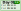
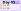
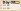
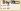
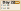
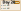

# Advent of Code

This is my try in solving the [Advent of Code](https://adventofcode.com) challenges. Note that 
[puzzle inputs](https://www.reddit.com/r/adventofcode/wiki/faqs/copyright/inputs/) should not be shared.

Some of the challenges where done in a [JavaScript simulation](https://slothsoft.github.io/advent-of-code/).

## How to Use

On December 1st, do this:

- update cookie in _Calendar/environment.json_
  - get the cookie by logging in to Advent of Code and displaying the cookies
- to update calendar tiles, use `cmd.exe /c '.\build.bat'`
- to create a new template, update year and programming language in _template.bat_ and then use `cmd.exe /c '.\template.bat 1'` ("1" being the day)

## Possibly general algorithms

- 2022/12 Dijkstra
- 2022/07 FileSystem
- 2022/16 Permutation

## To-Do-List

- move algorithms somewhere safe
    - Dijkstra is in 2019-20 and 2021-15 and 2023-17
    - Direction is EVERYWHERE
    - Stringify of the parsed matrixes (maybe extract matrixes?)
    - how to calculate quadratic function: 2023-21
    - `SnowverloadExtensions` from 2023-25
    - intersecting 3D lines: 2023-24

<!-- STEFFI, DO NOT ADD STUFF HERE! USE README-raw.md!!! -->

# 2024

# 2023

# 2022

# 2021

# 2020

# 2019

